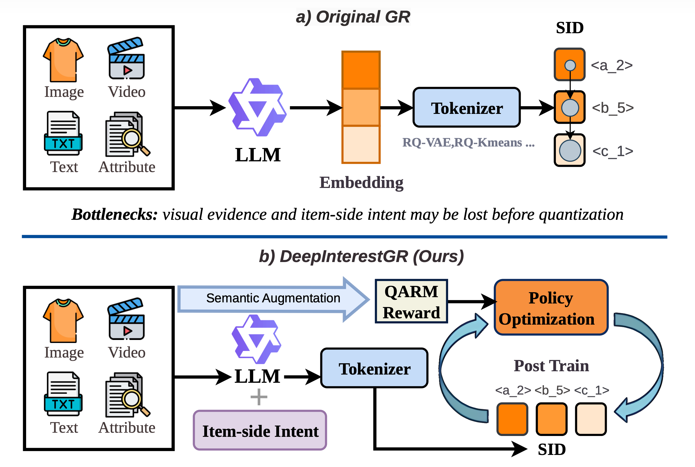

# DeepInterestGR

**Deep Interest Mining for Intent-Enriched Semantic IDs in Multimodal Generative Recommendation**

<p align="center">
  
</p>

DeepInterestGR enriches item evidence before SID quantization through **Cross-Modal Semantic Augmentation (CMSA)** and **Deep Contextual Interest Mining (DCIM)**, then uses the **Quality-Aware Reinforcement Mechanism (QARM)** during policy optimization.

## Core implementation

| Component | Code |
| --- | --- |
| CMSA caption and frozen-CLIP fusion | `src/deepinterestgr/cmsa.py` |
| DCIM deep-interest descriptors | `src/deepinterestgr/dcim.py` |
| QARM labels, aggregation, rewards, and GRPO equations | `src/deepinterestgr/qarm.py` |
| Three-level SID and collision suffix | `src/deepinterestgr/sid.py` |
| Prompts, seeds, preprocessing, settings, and cases | `artifacts/` |

## Quick start

```bash
python -m pip install -e .
python -m unittest discover -s tests -v
```

Optional integrations:

```bash
python -m pip install -e '.[api]'
python -m pip install -e '.[ml]'
```

API credentials, endpoints, deployment names, and unpublished integration values are supplied externally; see `.env.example`. The implementation keeps the paper's external RQ-VAE and training boundaries and does not download models or data during tests.

## Results

| Method | Beauty HR@5 | Sports HR@5 | Instruments HR@5 |
| --- | ---: | ---: | ---: |
| MiniOneRec | 0.0612 | 0.0398 | 0.0556 |
| **DeepInterestGR** | **0.0678** | **0.0452** | **0.0623** |

## Anonymity note

To comply with ICLR double-blind review, this package does not link to access-tracked cloud storage or redistribute files whose metadata may reveal author identity. Large data and training artifacts can be released after the anonymous review period.
